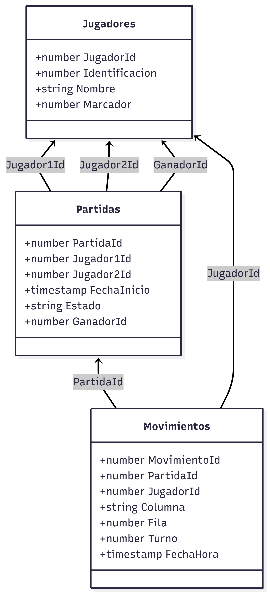
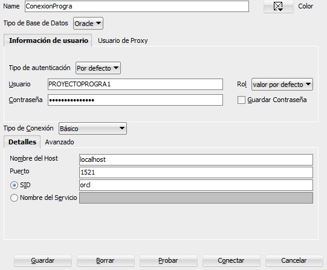
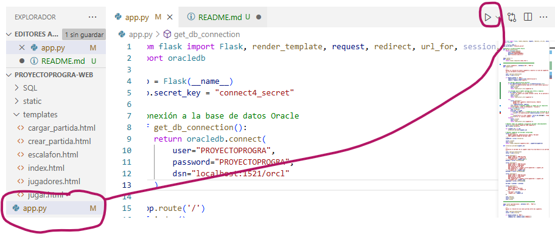
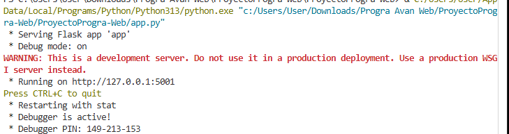

# Proyecto Avanzada Web - Juego Connect4

## 👥 Integrantes del Grupo

**Nombre:** Elsbe Nicole Obregón Munguía  
**Carné:** FI22024693  
**Usuario GitHub:** [nicoleobregon07](https://github.com/nicoleobregon07)  
**Correo Git:** nicoleobregon07@gmail.com

**Nombre:** Kevin Alberto Calvo Brenes  
**Carné:** FI23028470  
**Usuario GitHub:** [KevinC-B](https://github.com/KevinC-B)  
**Correo Git:** kev170103@gmail.com

---

## 🧰 Frameworks y Herramientas Utilizadas

### Backend:
- Flask (Python)
- oracledb (conector a Oracle Database)

### Frontend:
- HTML5, CSS3, Bootstrap 5
- JavaScript (AJAX)

### Base de Datos:
- Oracle SQL (SQL Developer)

### Otras herramientas:
- GitHub
- Visual Studio Code

---

## 🌐 Tipo de Aplicación
**MPA** (Multi Page Application)

---

## 🏛️ Arquitectura

La aplicación usa `app.py` como controlador principal, plantillas HTML como vistas, y Oracle como modelo (base de datos). Todo está organizado por rutas Flask que conectan las vistas con la lógica de negocio.

---

## 🗂️ Diagrama de la Base de Datos (Mermaid)


---

## ⚙️ Instrucciones de Instalación, Configuración y Ejecución

### 1. 🧱 Crear usuario y base de datos en Oracle

Desde la terminal con SQL*Plus o CMD:

```sql
sqlplus sys as sysdba

CREATE USER PROYECTOPROGRA1 IDENTIFIED BY PROYECTOPROGRA1;
GRANT CREATE SESSION TO PROYECTOPROGRA1;
GRANT ALL PRIVILEGES TO PROYECTOPROGRA1;
```

---

### 1.2 📄 Crear conexión en SQL Developer

Abre SQL Developer y seguí estos pasos para crear una nueva conexión:

- **Nombre de conexión:** cualquier nombre (por ejemplo: ConexionProgra)
- **Usuario:** PROYECTOPROGRA1
- **Contraseña:** PROYECTOPROGRA1
- **SID:** orcl

✅ Luego hacé clic en **Guardar y Conectar**.

> ℹ️ Tenés que haber creado el usuario en SQL*Plus antes de hacer la conexión.

---

### 2. 🧱 Crear las tablas necesarias

Ejecutá el siguiente script SQL en Oracle:

```sql
CREATE TABLE Jugadores (
    JugadorId NUMBER GENERATED ALWAYS AS IDENTITY PRIMARY KEY,
    Identificacion NUMBER UNIQUE NOT NULL,
    Nombre VARCHAR2(100) NOT NULL,
    Marcador NUMBER DEFAULT 0
);

CREATE TABLE Partidas (
    PartidaId NUMBER GENERATED ALWAYS AS IDENTITY PRIMARY KEY,
    Jugador1Id NUMBER NOT NULL,
    Jugador2Id NUMBER NOT NULL,
    FechaInicio TIMESTAMP DEFAULT CURRENT_TIMESTAMP,
    Estado VARCHAR2(20) DEFAULT 'EN_CURSO',
    GanadorId NUMBER,
    FOREIGN KEY (Jugador1Id) REFERENCES Jugadores(JugadorId),
    FOREIGN KEY (Jugador2Id) REFERENCES Jugadores(JugadorId),
    FOREIGN KEY (GanadorId) REFERENCES Jugadores(JugadorId)
);

CREATE TABLE Movimientos (
    MovimientoId NUMBER GENERATED ALWAYS AS IDENTITY PRIMARY KEY,
    PartidaId NUMBER NOT NULL,
    JugadorId NUMBER NOT NULL,
    Columna VARCHAR2(1) NOT NULL,
    Fila NUMBER NOT NULL,
    Turno NUMBER NOT NULL,
    FechaHora TIMESTAMP DEFAULT CURRENT_TIMESTAMP,
    FOREIGN KEY (PartidaId) REFERENCES Partidas(PartidaId),
    FOREIGN KEY (JugadorId) REFERENCES Jugadores(JugadorId)
);
```

---

### 3. 🐍 Instalar Python y paquetes necesarios

Desde la terminal, ejecutá:

```bash
pip install flask oracledb
```

---

### 4. 📂 Clonar el repositorio

```bash
git clone https://github.com/nicoleobregon07/Proyecto-progra-avan-web.git
```

---

### 5. ⚙️ Configurar conexión a Oracle

Editá el archivo `app.py` y asegurate de que la función `get_db_connection()` esté así:

```python
def get_db_connection():
    return oracledb.connect(
        user="PROYECTOPROGRA1",
        password="PROYECTOPROGRA1",
        dsn="localhost:1521/orcl"
    )
```

📌 **Parámetros clave:**
- `user`: nombre del usuario Oracle.
- `password`: contraseña correspondiente.
- `dsn`: dirección del servicio Oracle, normalmente `localhost:1521/orcl`.

> ⚠️ Si usás otro SID, IP o puerto, modificá el `dsn` según tu entorno.


---

### 6. 🚀 Ejecutar la aplicación

1. Abrí una terminal en la carpeta del proyecto.
2. Ejecutá el archivo principal con:

```bash
python app.py
```
Ejemplo: 

3. Luego abrí tu navegador y visitá:

```
http://localhost:5###/
```
Depende cual le abre: 
---

## 7. 📚 Referencias y Prompts AI utilizados

> Poner referencias si es necesario.
